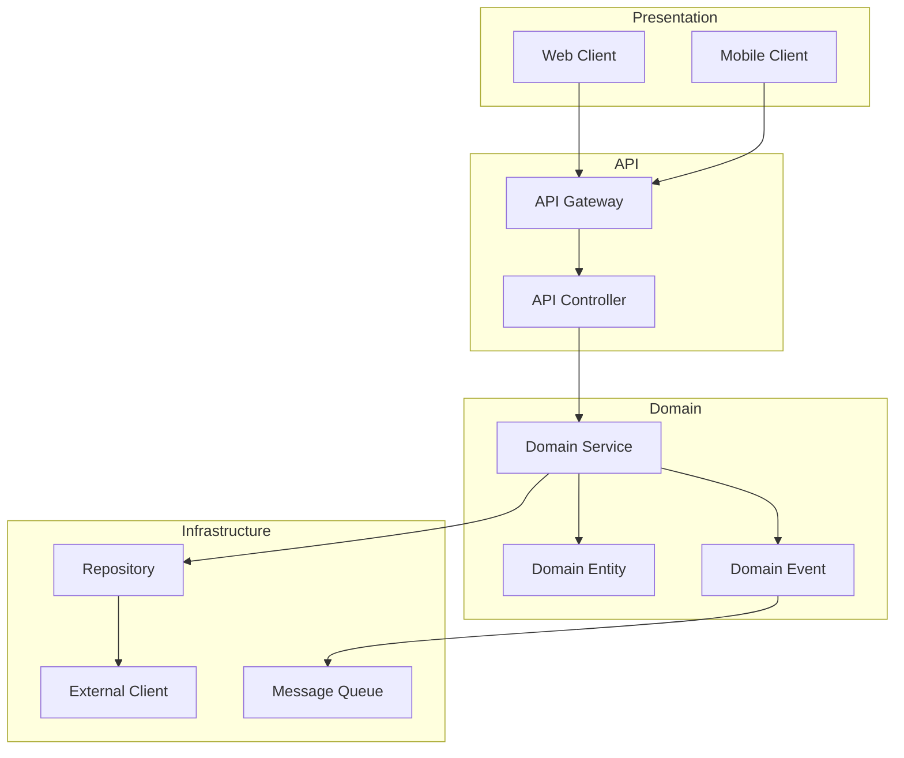
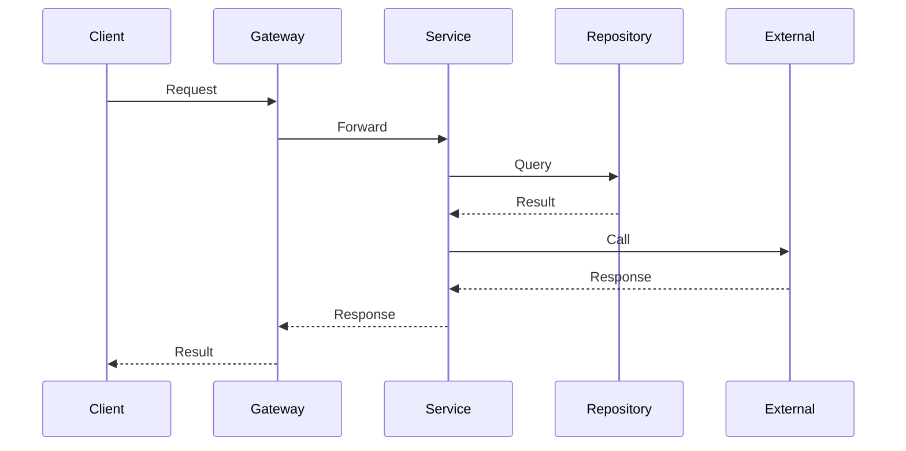

# Component Diagram: {Nome da Feature}

## Metadata
| Campo | Valor |
|-------|-------|
| Data | {YYYY-MM-DD} |
| Autor | Solution Architect Agent |
| Versão | 1.0.0 |
| Status | Rascunho |
| Skill Associada | uml-architecture |

---

## Visão Geral

{Breve descrição dos componentes desta feature ou módulo}

---

## Diagrama de Componentes

---

## Componentes

### {Nome do Componente 1}
| Atributo | Valor |
|---------|-------|
| Responsabilidade | {Descrição da responsabilidade} |
| Interfaces | {Interfaces expostas} |
| Dependências | {Dependências internas} |
| Tecnologia | {Tech stack} |

### {Nome do Componente 2}
| Atributo | Valor |
|---------|-------|
| Responsabilidade | {Descrição da responsabilidade} |
| Interfaces | {Interfaces expostas} |
| Dependências | {Dependências internas} |
| Tecnologia | {Tech stack} |

---

## Interfaces de Componentes

### {Interface Name}
| Método | Entrada | Saída | Descrição |
|--------|--------|------|----------|
| {Method} | {Input} | {Output} | {Description} |

---

## Fluxo de Dados Entre Componentes

---

## Estados

| Componente | Estados Possíveis |
|------------|------------------|
| {Component} | {State1}, {State2}, {State3} |

---

## Exceções

| Cenário | Componente | Ação |
|---------|------------|-------|
| {Error 1} | {Component} | {Action} |
| {Error 2} | {Component} | {Action} |

---

## Padrões de Projeto Utilizados

| Padrão | Componente | Justificativa |
|--------|------------|--------------|
| {Pattern 1} | {Component} | {Reason} |
| {Pattern 2} | {Component} | {Reason} |

---

## Dúvidas em Aberto ❓
| # | Pergunta | Por que preciso saber |
|----|---------|---------------------|
| 1 | {Pergunta 1} | {Justificativa 1} |
| 2 | {Pergunta 2} | {Justificativa 2} |

---

## Próximos Passos
- [ ] Detalhar cada componente
- [ ] Definir контраtos de interface
- [ ] Criar protótipos
- [ ] Implementar componentes

---

## Anexo: Histórico de Versões
| Versão | Data | Autor | Mudanças |
|--------|------|-------|----------|
| 1.0.0 | {YYYY-MM-DD} | Solution Architect Agent | Versão inicial |