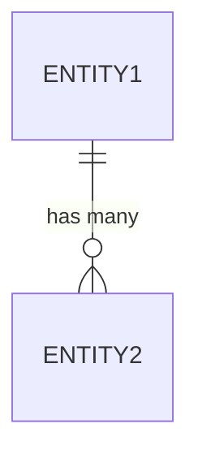

# Data Model: {Nome do Domínio}

## Metadata
| Campo | Valor |
|-------|-------|
| Data | {YYYY-MM-DD} |
| Autor | Solution Architect Agent |
| Versão | 1.0.0 |
| Status | Rascunho |
| Skill Associada | database-architecture |

---

## Visão Geral

{Descrição do modelo de dados para o domínio}

---

## Entidades

### {Nome da Entidade 1}
| Campo | Tipo | Obrigatório | Descrição | Padrão |
|-------|------|------------|-----------|-------|
| id | UUID | Sim | Chave primária | Auto-gerado |
| {field1} | string | Sim | {Description} | - |
| {field2} | string | Não | {Description} | null |
| {field3} | number | Não | {Description} | 0 |
| {field4} | boolean | Não | {Description} | false |
| created_at | timestamp | Sim | Data de criação | Auto |
| updated_at | timestamp | Sim | Data de atualização | Auto |

### {Nome da Entidade 2}
| Campo | Tipo | Obrigatório | Descrição | Padrão |
|-------|------|------------|-----------|-------|
| id | UUID | Sim | Chave primária | Auto-gerado |
| {field1} | UUID | Sim | FK para {Entity 1} | - |
| {field2} | string | Não | {Description} | null |
| created_at | timestamp | Sim | Data de criação | Auto |
| updated_at | timestamp | Sim | Data de atualização | Auto |

---

## Índices

| Índice | Colunas | Tipo | Único |
|--------|--------|------|-------|
| idx_{entity1}_id | id | Primary | Sim |
| idx_{entity1}_{field} | {field} | B-Tree | Não |
| idx_{entity2}_{field} | {field} | B-Tree | Sim |

---

## Relacionamentos

| Entidade A | Entidade B | Tipo | Cardinalidade | Descrição |
|------------|------------|------|--------------|-----------|
| {Entity1} | {Entity2} | One-to-Many | 1:N | {Entity1} tem muitos {Entity2} |
| {Entity2} | {Entity1} | Many-to-One | N:1 | {Entity2} pertence a {Entity1} |

### Diagrama ER



---

## Constraints

| Constraint | Tipo | Coluna(s) | regra |
|------------|------|-----------|-------|
| {constraint_name} | Check | {field} | {rule} |
| {constraint_name} | Unique | {field} | {rule} |

---

## API Contract

### GET /{resources}
**Response**
```json
{
  "data": [
    {
      "id": "uuid",
      "{field1}": "string",
      "{field2}": "string",
      "created_at": "timestamp",
      "updated_at": "timestamp"
    }
  ],
  "meta": {
    "total": 100,
    "page": 1,
    "per_page": 20
  }
}
```

### POST /{resources}
**Request**
```json
{
  "{field1}": "string",
  "{field2}": "string"
}
```

**Response**
```json
{
  "data": {
    "id": "uuid",
    "{field1}": "string",
    "{field2}": "string",
    "created_at": "timestamp"
  }
}
```

---

## Migrate Up

```sql
CREATE TABLE {table_name} (
    id UUID PRIMARY KEY DEFAULT gen_random_uuid(),
    {field1} VARCHAR(255) NOT NULL,
    {field2} VARCHAR(255),
    {field3} INTEGER DEFAULT 0,
    {field4} BOOLEAN DEFAULT FALSE,
    created_at TIMESTAMP WITH TIME ZONE DEFAULT NOW(),
    updated_at TIMESTAMP WITH TIME ZONE DEFAULT NOW()
);

CREATE INDEX idx_{table}_{field} ON {table_name}({field});
```

---

## Migrate Down

```sql
DROP TABLE {table_name};
```

---

## Dúvidas em Aberto ❓
| # | Pergunta | Por que preciso saber |
|----|---------|---------------------|
| 1 | {Pergunta 1} | {Justificativa 1} |
| 2 | {Pergunta 2} | {Justificativa 2} |

---

## Próximos Passos
- [ ] Criar migrations
- [ ] Popular dados iniciais
- [ ] Criarseed scripts
- [ ] Definir estratégia de backup

---

## Anexo: Histórico de Versões
| Versão | Data | Autor | Mudanças |
|--------|------|-------|----------|
| 1.0.0 | {YYYY-MM-DD} | Solution Architect Agent | Versão inicial |