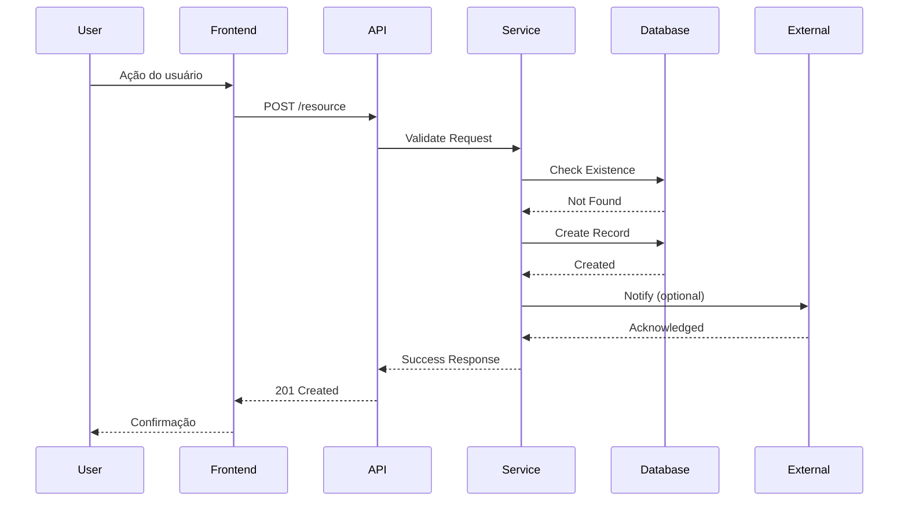
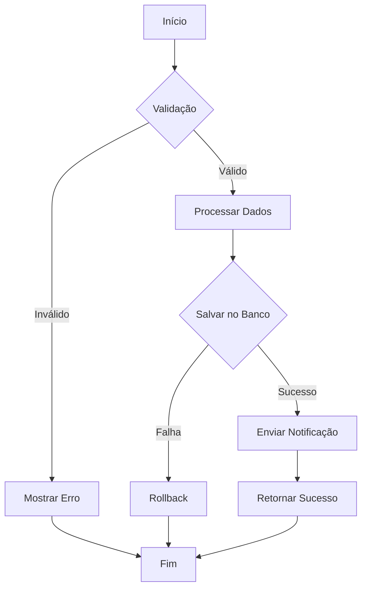

# Flow Diagram: {Nome do Fluxo}

## Metadata
| Campo | Valor |
|-------|-------|
| Data | {YYYY-MM-DD} |
| Autor | Solution Architect Agent |
| Versão | 1.0.0 |
| Status | Rascunho |
| Skill Associada | diagram-drawing |

---

## Visão Geral

{Descrição do fluxo em 1-2 linhas}

---

## Diagrama de Sequência

---

## Diagrama de Atividades

---

## Passos do Fluxo

| Passo | Ação | Responsável | Tempo Máximo |
|-------|------|------------|---------------|
| 1 | Receber requisição | API Gateway | < 50ms |
| 2 | Validar entrada | Service | < 100ms |
| 3 | Verificar permissões | Auth Service | < 50ms |
| 4 | Processar dados | Business Logic | < 500ms |
| 5 | Persistir dados | Database | < 200ms |
| 6 | Responder ao cliente | API | < 50ms |

---

## Casos de Sucesso

| Cenário | Condição | Resultado |
|--------|---------|----------|
| happy_path | Todos os dados válidos | 201 Created |
| partial | Alguns dados opcionais | 201 Created |

---

## Casos de Erro

| Cenário | Condição | Código | Mensagem |
|--------|---------|--------|----------|
| invalid_request | Dados inválidos | 400 | "Invalid request payload" |
| unauthorized | Token ausente | 401 | "Authentication required" |
| forbidden | Sem permissão | 403 | "Insufficient permissions" |
| not_found | Recurso não existe | 404 | "Resource not found" |
| conflict | Conflito de estado | 409 | "Resource conflict" |
| server_error | Erro interno | 500 | "Internal server error" |

---

## Dados de Input

| Campo | Tipo | Obrigatório | Validação |
|-------|------|------------|----------|
| {field1} | {string} | Sim | {rule} |
| {field2} | {number} | Não | {rule} |
| {field3} | {boolean} | Não | {rule} |

---

## Dados de Output

| Campo | Tipo | Descrição |
|-------|------|----------|
| {field1} | {string} | {Description} |
| {field2} | {number} | {Description} |
| {created_at} | {timestamp} | Data de criação |
| {updated_at} | {timestamp} | Data de atualização |

---

## Side Effects

| Ação | Impacto |
|------|--------|
| {Side effect 1} | {Impact description} |
| {Side effect 2} | {Impact description} |

---

## Dúvidas em Aberto ❓
| # | Pergunta | Por que preciso saber |
|----|---------|---------------------|
| 1 | {Pergunta 1} | {Justificativa 1} |
| 2 | {Pergunta 2} | {Justificativa 2} |

---

## Próximos Passos
- [ ] Implementar fluxo
- [ ] Criar testes unitários
- [ ] Criar testes de integração
- [ ] Documentar API

---

## Anexo: Histórico de Versões
| Versão | Data | Autor | Mudanças |
|--------|------|-------|----------|
| 1.0.0 | {YYYY-MM-DD} | Solution Architect Agent | Versão inicial |