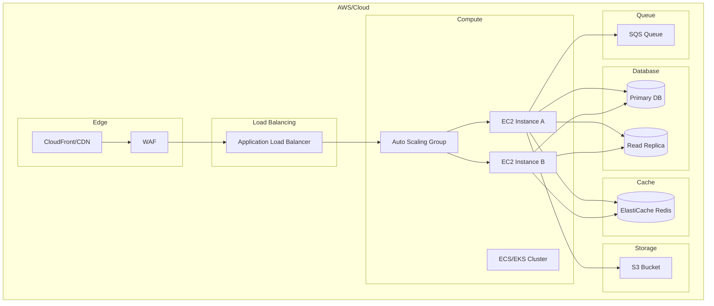

# Infrastructure Architecture: {Nome da Solução}

## Metadata
| Campo | Valor |
|-------|-------|
| Data | {YYYY-MM-DD} |
| Autor | Solution Architect Agent |
| Versão | 1.0.0 |
| Status | Rascunho |
| Skill Associada | devops |

---

## Visão Geral

{Descrição da arquitetura de infraestrutura em 1-2 linhas}

---

## Arquitetura de Infraestrutura

---

## Componentes de Infraestrutura

### Compute
| Recurso | Serviço | Configuração |
|--------|---------|--------------|
| Instances | EC2 | {t3.large, t3.xlarge} |
| Auto Scaling | ASG | {min: 2, max: 10} |
| Container | ECS/Fargate | {task definition} |

### Database
| Recurso | Serviço | Configuração |
|--------|---------|--------------|
| Primary | RDS PostgreSQL | {db.t3.medium} |
| Read Replica | RDS PostgreSQL | {db.t3.small} |
| Cache | ElastiCache | {cache.t3.micro} |

### Networking
| Recurso | Serviço | Configuração |
|--------|---------|--------------|
| VPC | VPC | {10.0.0.0/16} |
| Subnets | Subnets | {Public + Private} |
| ALB | Application LB | {Cross-zone enabled} |
| CDN | CloudFront | {Global} |

### Storage
| Recurso | Serviço | Configuração |
|--------|---------|--------------|
| Objects | S3 | {Standard-IA} |
| Files | EFS | {Performance mode} |

### Messaging
| Recurso | Serviço | Configuração |
|--------|---------|--------------|
| Queue | SQS | {FIFO option} |
| Events | EventBridge | {Rule definitions} |

---

## Zonas de Disponibilidade

| AZ | subnet | Recursos |
|-----|--------|----------|
| {Region}a | {Subnet ID} | {EC2, RDS Primary} |
| {Region}b | {Subnet ID} | {EC2, RDS Replica} |
| {Region}c | {Subnet ID} | {Reserved} |

---

## Security Group Rules

### Application SG
| Tipo | Protocolo | Porta | Origem |
|------|-----------|-------|--------|
| HTTP | TCP | 80 | ALB SG |
| HTTPS | TCP | 443 | ALB SG |
| SSH | TCP | 22 | {Bastion IP} |

### Database SG
| Tipo | Protocolo | Porta | Origem |
|------|-----------|-------|--------|
| PostgreSQL | TCP | 5432 | Application SG |

### Redis SG
| Tipo | Protocolo | Porta | Origem |
|------|-----------|-------|--------|
| Redis | TCP | 6379 | Application SG |

---

## Auto Scaling

| Métrica | Condição | Ação |
|--------|---------|-------|
| CPU Utilization | > 70% | Scale out +1 |
| CPU Utilization | < 30% | Scale in -1 |
| Request Count | > 10000/min | Scale out +1 |
| Request Count | < 2000/min | Scale in -1 |

---

## Disaster Recovery

| Estratégia | RPO | RTO |
|------------|-----|-----|
| Backup Diário | 24 horas | 4 horas |
| Multi-AZ | 0 | 1 hora |
| Cross-Region | 0 | 2 horas |

---

## monitoring

| Métrica | Alerta | Threshold |
|---------|--------|----------|
| CPU | Warning | > 70% |
| CPU | Critical | > 90% |
| Memory | Warning | > 80% |
| Disk | Warning | > 85% |
| Latency | Warning | > 500ms |

---

## Cost Estimation

| Serviço | Uso Estimado | Custo Mensal |
|---------|-------------|-------------|
| EC2 | {N} instances | ${X}/mês |
| RDS | {N} instances | ${X}/mês |
| S3 | {N} GB | ${X}/mês |
| CloudFront | {N} GB | ${X}/mês |
| Data Transfer | {N} GB | ${X}/mês |

---

## Dúvidas em Aberto ❓
| # | Pergunta | Por que preciso saber |
|----|---------|---------------------|
| 1 | {Pergunta 1} | {Justificativa 1} |
| 2 | {Pergunta 2} | {Justificativa 2} |

---

## Próximos Passos
- [ ] Criar Terraform/CloudFormation templates
- [ ] Configurar CI/CD pipeline
- [ ] Configurar monitoring e alerting
- [ ] Definir runbooks

---

## Anexo: Histórico de Versões
| Versão | Data | Autor | Mudanças |
|--------|------|-------|----------|
| 1.0.0 | {YYYY-MM-DD} | Solution Architect Agent | Versão inicial |