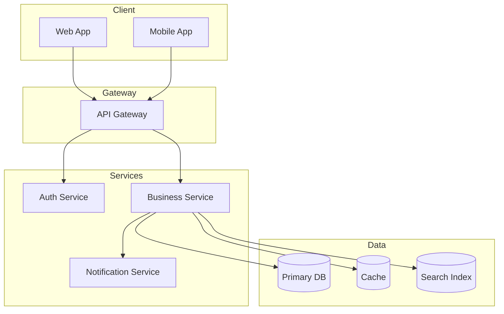

# Solution Architecture: {Nome da Solução}

## Metadata
| Campo | Valor |
|-------|-------|
| Data | {YYYY-MM-DD} |
| Autor | Solution Architect Agent |
| Versão | 1.0.0 |
| Status | Rascunho |
| Skill Associada | software-architecture |

---

## Visão Geral

{Breve descrição da solução em 2-3 linhas}

---

## Requisitos

### Requisitos Funcionais
| ID | Requisito | Prioridade |
|----|----------|------------|
| REQ-001 | {Descrição do requisito funcional} | Must |
| REQ-002 | {Descrição do requisito funcional} | Should |
| REQ-003 | {Descrição do requisito funcional} | Could |

### Requisitos Não-Funcionais
| ID | Categoria | Requisito | Meta |
|----|----------|-----------|------|
| RNF-001 | Performance | {Requisitos de performance} | < {X}ms |
| RNF-002 | Security | {Requisitos de segurança} | {Nível} |
| RNF-003 | Scalability | {Requisitos de escalabilidade} | {N} req/s |
| RNF-004 | Availability | {Requisitos de disponibilidade} | {X}% |

---

## Complexidade do Projeto

| Dimensão | Avaliação | Justificativa |
|---------|-----------|--------------|
| Tamanho | {Small/Medium/Large/Critical} | {Justificativa baseada em funcionalidades} |
| Equipes | {N} equipes | {Quantidade de equipes} |
| Prazo | {估计} meses | {Prazo do projeto} |
| Integrações | {N} externas | {Sistemas externos} |

---

## Tipo de Arquitetura

### Escolha
**{Tipo de Arquitetura Eselhida}**

### Justificativa
{Explicação detalhada de por que este tipo de arquitetura foi escolhido}

### Prós
- {Prós 1}
- {Prós 2}
- {Prós 3}

### Contras
- {Contras 1}
- {Contras 2}

---

## Visão Geral da Solução

### Diagrama de Arquitetura

---

## Componentes

| Componente | Responsabilidade | Tecnologia | Dependências |
|-----------|---------------|------------|-------------|
| API Gateway | Roteamento, autenticação | {Tech} | - |
| Auth Service | Gerenciamento de identidade | {Tech} | DB |
| Business Service | Lógica de negócio | {Tech} | DB, Cache |
| Notification Service | Envio de notificações | {Tech} | External API |

---

## Fluxo de Dados

| Fluxo | De | Para | Descrição |
|-------|---|------|-----------|
| auth_flow | Client | Auth Service | Autenticação do usuário |
| business_flow | Client | Business Service | Operações de negócio |
| notification | Business Service | Notification Service | Envio de notificações |

---

## Interfaces

### APIs
| Endpoint | Método | Descrição | Autenticação |
|---------|--------|----------|-------------|
| /auth/login | POST | Login de usuário | Não |
| /auth/refresh | POST | Refresh token | Sim |
| /users | GET | Listar usuários | Sim |
| /users | POST | Criar usuário | Sim |
| /users/:id | PUT | Atualizar usuário | Sim |
| /users/:id | DELETE | Deletar usuário | Sim |

---

## Segurança

| Aspecto | Estratégia | Implementação |
|---------|------------|---------------|
| Autenticação | JWT | Token com expiração |
| Autorização | RBAC | Papéis e permissões |
| Dados em trânsito | TLS 1.3 | HTTPS obrigatório |
| Dados em repouso | Encryption | AES-256 |
| API Security | Rate Limiting | {N} req/min |

---

## Escalabilidade

| Estratégia | Implementação |
|-----------|-------------|
| Horizontal | Auto Scaling Groups |
| Cache | Redis/Memcached |
| Database | Read Replicas |
| CDN | Static assets |

---

## Observabilidade

| Tipo | Ferramenta |
|------|-----------|
| Logging | {Tool} |
| Metrics | {Tool} |
| Tracing | {Tool} |
| Alerting | {Tool} |

---

## Dependências

| Dependência | Versão | Justificativa |
|------------|-------|-------------|
| {Library 1} | {v1.x} | {Reason} |
| {Library 2} | {v2.x} | {Reason} |
| {Service} | {API v3} | {Reason} |

---

## Riscos e Mitigações

| Risco | Impacto | Probabilidade | Mitigação |
|-------|---------|--------------|-----------|
| {Risk 1} | {High/Medium/Low} | {High/Medium/Low} | {Mitigation} |
| {Risk 2} | {High/Medium/Low} | {High/Medium/Low} | {Mitigation} |

---

## Dúvidas em Aberto ❓
| # | Pergunta | Por que preciso saber |
|----|---------|---------------------|
| 1 | {Pergunta 1} | {Justificativa 1} |
| 2 | {Pergunta 2} | {Justificativa 2} |

---

## Próximos Passos
- [ ] Revisar arquitetura com tech lead
- [ ] Validar com stakeholders técnicos
- [ ] Criar Architecture Decision Records (ADRs)
- [ ] Detalhar componentes específicos
- [ ] Definir infraestrutura

---

## Anexo: Histórico de Versões
| Versão | Data | Autor | Mudanças |
|--------|------|-------|----------|
| 1.0.0 | {YYYY-MM-DD} | Solution Architect Agent | Versão inicial |