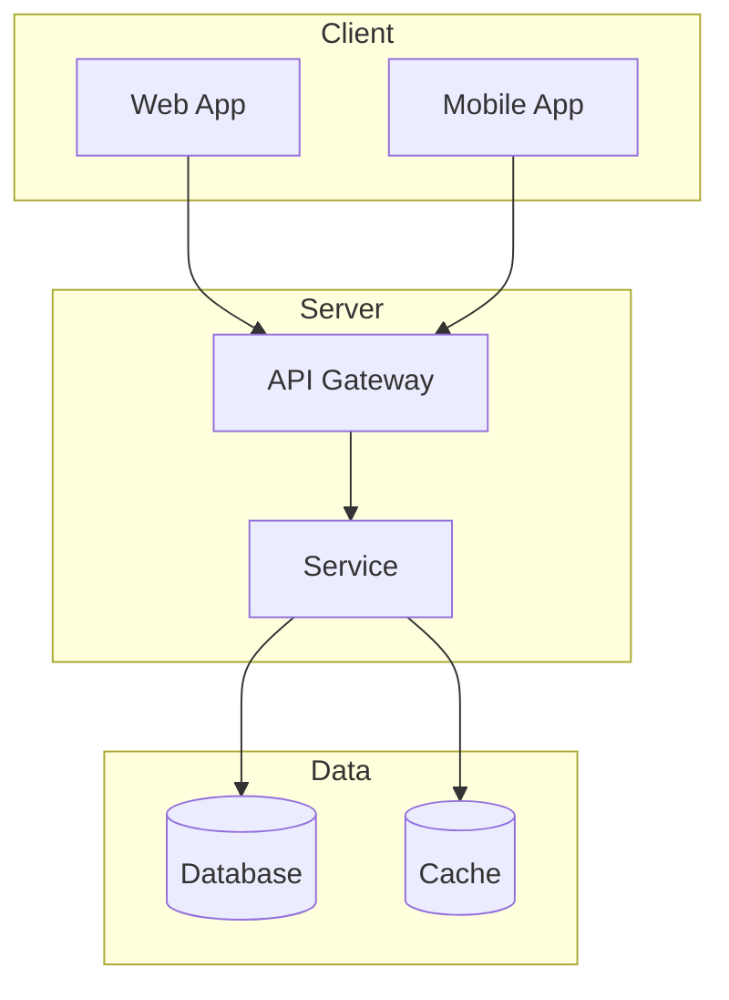

# {Nome do Projeto}

[](https://)
[](https://)
[](https://)
[](https://)

## Descrição

{Descrição breve do projeto em 1-2 linhas}

{Descrição detalhada do projeto}

---

## Quick Start

```bash
# Clone o projeto
git clone https://github.com/{owner}/{project}.git
cd {project}

# Instale dependências
npm install

# Execute
npm run dev
```

---

## Índice

- [Features](#features)
- [Tecnologias](#tecnologias)
- [Instalação](#instalação)
- [Uso](#uso)
- [API](#api)
- [Arquitetura](#arquitetura)
- [Contribuição](#contribuição)
- [Licença](#licença)

---

## Features

- ✨ {Feature 1}
- ⚡ {Feature 2}
- 🔒 {Feature 3}
- 📦 {Feature 4}

---

## Tecnologias

| Categoria | Tecnologia |
|-----------|------------|
| Backend | {Node.js/Python} {vX} |
| Frontend | {React/Vue} {vX} |
| Database | {PostgreSQL/MongoDB} {vX} |
| Testing | {Jest/Pytest} |

---

## Instalação

Para instruções detalhadas, veja [INSTALL.md](./INSTALL.md).

### Pré-requisitos

- {Tecnologia 1} {versão}
- {Tecnologia 2} {versão}

### Passos

```bash
npm install
```

---

## Uso

### Exemplo Básico

```typescript
import { Module } from '{package}';

const result = Module.{method}({params});
console.log(result);
```

### Exemplo Avançado

```typescript
import { Module } from '{package}';

const config = {{
  option1: 'value1',
  option2: 'value2'
}};

const result = Module.{method}(params, config);
```

---

## API

Para documentação completa da API, veja [API-documentation.md](./API-documentation.md).

### Autenticação

```typescript
const token = await fetch('/auth/login', {{
  method: 'POST',
  body: JSON.stringify({{ email, password }})
}}).then(res => res.json());
```

### Endpoints Principais

| Método | Endpoint | Descrição |
|--------|----------|-----------|
| GET | /api/{resource} | Listar {resource} |
| POST | /api/{resource} | Criar {resource} |
| GET | /api/{resource}/:id | Detalhar {resource} |
| PUT | /api/{resource}/:id | Atualizar {resource} |
| DELETE | /api/{resource}/:id | Deletar {resource} |

---

## Arquitetura

Para documentação detalhada da arquitetura, see [architecture.md](./architecture.md).

### Diagrama de Arquitetura



---

## Contribuição

Para contribuir, siga as diretrizes em [CONTRIBUTING.md](./CONTRIBUTING.md).

1. Fork o projeto
2. Crie sua branch (`git checkout -b feature/nova-funcionalidade`)
3. Commit suas alterações (`git commit -m 'feat: nova funcionalidade'`)
4. Push para a branch (`git push origin feature/nova-funcionalidade`)
5. Abra um Pull Request

---

## Licença

MIT License - see [LICENSE](./LICENSE) para detalhes.

---

## Contato

- Autor: {Nome}
- Email: {email}
- GitHub: https://github.com/{owner}

---

## Agradecimentos

{Agradecimentos opcionais}