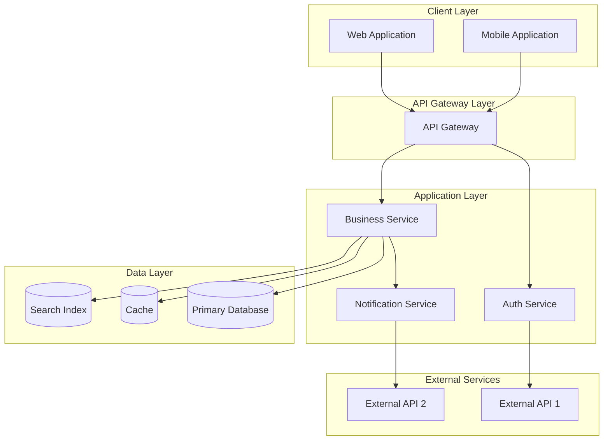
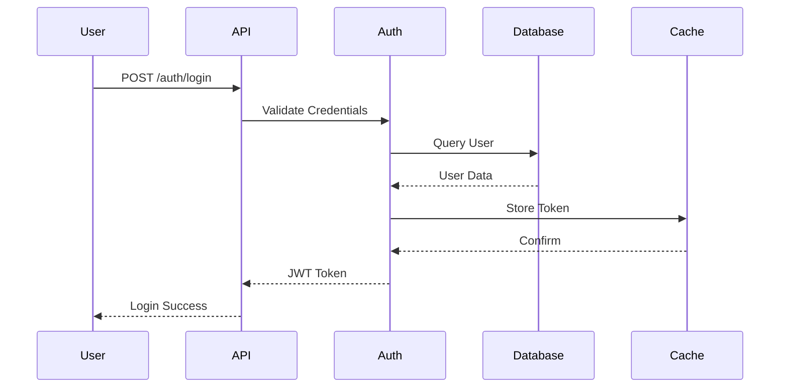
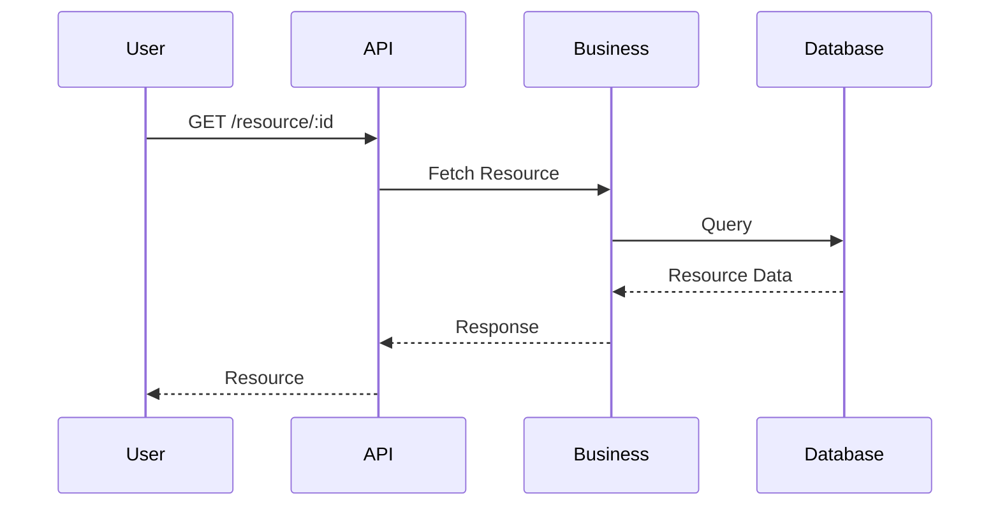
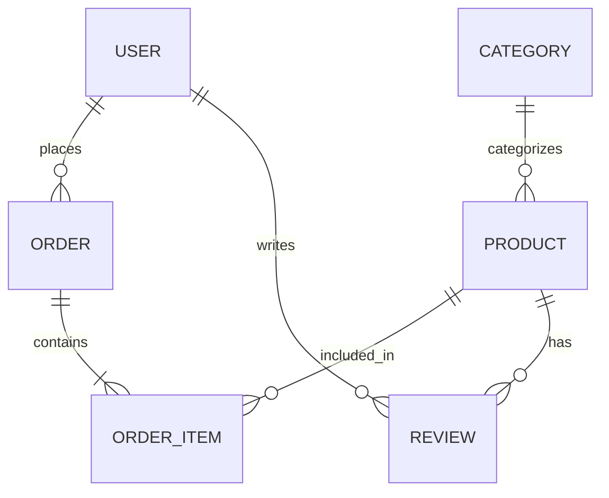
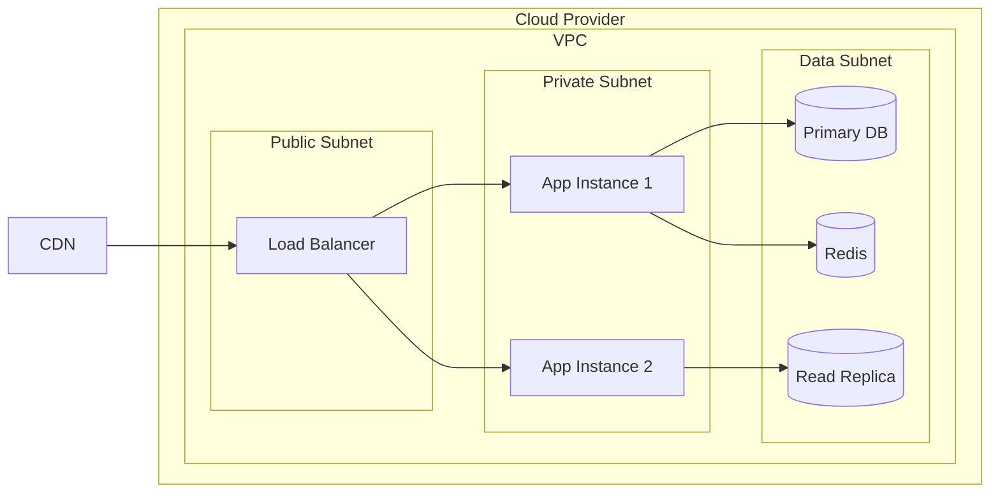

# Architecture Documentation

## Visão Geral do Sistema

{Descrição breve do sistema em 1-2 linhas}

{Descrição detalhada do sistema}

---

## Diagrama de Arquitetura

---

## Componentes

### API Gateway

| Propriedade | Valor |
|-------------|-------|
| Responsabilidade | Roteamento, autenticação, rate limiting |
| Tecnologia | Express/NestJS |
| Porta | 3000 |

### Auth Service

| Propriedade | Valor |
|-------------|-------|
| Responsabilidade | Autenticação, autorização, JWT |
| Tecnologia | Node.js/TypeScript |
| Dependências | Database, External APIs |

### Business Service

| Propriedade | Valor |
|-------------|-------|
| Responsabilidade | Lógica de negócio principal |
| Tecnologia | Node.js/TypeScript |
| Dependências | Database, Cache, Search |

### Notification Service

| Propriedade | Valor |
|-------------|-------|
| Responsabilidade | Envio de notificações |
| Tecnologia | Node.js/TypeScript |
| Dependências | External Notification APIs |

---

## Fluxo de Dados

### Fluxo de Autenticação

### Fluxo de Operações CRUD

---

## Modelo de Dados

### Diagrama ER

### Tabelas Principais

#### User Table

| Campo | Tipo | Descrição |
|-------|------|-----------|
| id | UUID | Chave primária |
| email | VARCHAR(255) | Email único |
| password_hash | VARCHAR(255) | Hash de senha |
| created_at | TIMESTAMP | Data de criação |
| updated_at | TIMESTAMP | Data de atualização |

#### Order Table

| Campo | Tipo | Descrição |
|-------|------|-----------|
| id | UUID | Chave primária |
| user_id | UUID | FK para User |
| status | ENUM | Status do pedido |
| total | DECIMAL | Valor total |
| created_at | TIMESTAMP | Data de criação |

---

## Segurança

### Camadas de Segurança

| Camada | Implementação |
|--------|---------------|
| HTTPS | TLS 1.3 obrigatório |
| Autenticação | JWT com refresh tokens |
| Autorização | RBAC |
| Dados | Criptografia em repouso (AES-256) |
| API | Rate limiting, WAF |

### Vulnerabilidades Comuns Protegidas

- ✅ SQL Injection prevention
- ✅ XSS prevention
- ✅ CSRF protection
- ✅ Rate limiting
- ✅ Input validation

---

## Escalabilidade

### Estratégias

| Estratégia | Implementação |
|------------|-------------|
| Horizontal | Auto-scaling groups |
| Database | Read replicas |
| Cache | Redis/Memcached |
| CDN | CloudFront/Cloudflare |

---

## Monitoramento

### Métricas

| Métrica | Ferramenta |
|--------|------------|
| Logging | Pino/Winston |
| Metrics | Prometheus |
| Tracing | Jaeger |
| Alerting | PagerDuty |

---

## Infraestrutura

### Ambiente de Produção

---

## Tecnologias

| Categoria | Tecnologia |
|-----------|------------|
| Backend | Node.js 18, TypeScript |
| API | Express/NestJS |
| Database | PostgreSQL 15 |
| Cache | Redis 7 |
| Search | Elasticsearch |
| Container | Docker, Docker Compose |
| Cloud | AWS |

---

## Glossário

| Termo | Definição |
|------|-----------|
| RBAC | Role-Based Access Control |
| JWT | JSON Web Token |
| API | Application Programming Interface |
| CRUD | Create, Read, Update, Delete |

---

## Referências

- [Solution Architecture](../architect_agent/solution-architecture.md)
- [API Documentation](./API-documentation.md)
- [Security Guidelines](./SECURITY.md)