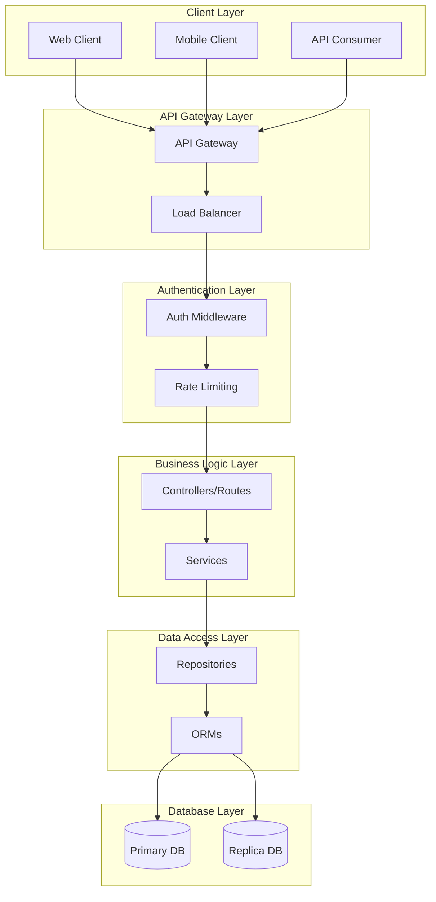
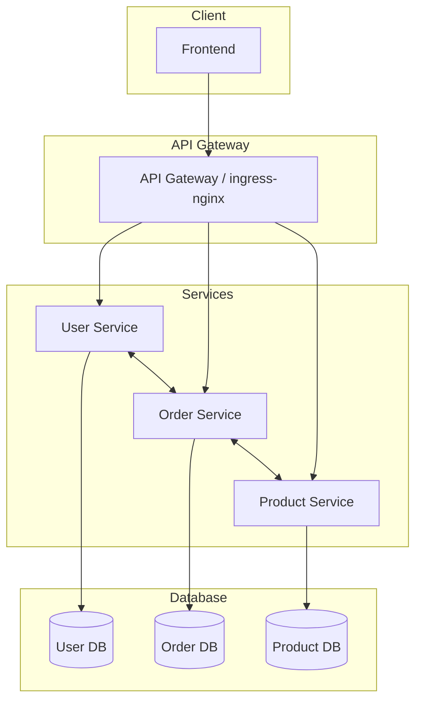
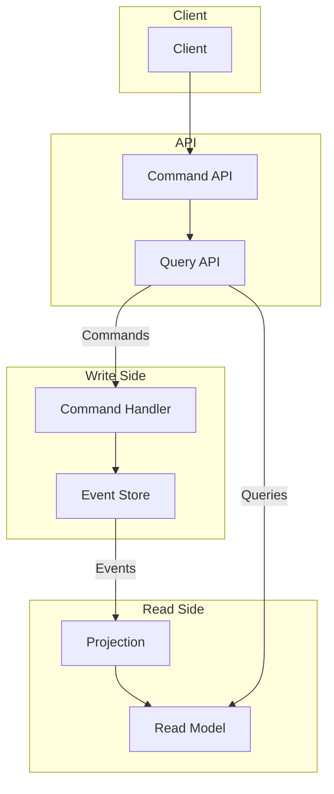

# API Architecture

## Layered Architecture

```mermaid
flowchart TD
    subgraph Client Layer
        A[Web Client]
        B[Mobile Client]
        C[API Consumer]
    end
    
    subgraph API Gateway Layer
        D[API Gateway]
        E[Load Balancer]
    end
    
    subgraph Authentication Layer
        F[Auth Middleware]
        G[Rate Limiting]
    end
    
    subgraph Business Logic Layer
        H[Controllers/Routes]
        I[Services]
    end
    
    subgraph Data Access Layer
        J[Repositories]
        K[ORMs]
    end
    
    subgraph Database Layer
        L[(Primary DB)]
        M[(Replica DB)]
    end
    
    A --> D
    B --> D
    C --> D
    D --> E
    E --> F
    F --> G
    G --> H
    H --> I
    I --> J
    J --> K
    K --> L
    K --> M
```

## Microservices Architecture

```mermaid
flowchart TD
    subgraph Client
        A[Frontend]
    end
    
    subgraph API Gateway
        B[API Gateway / ingress-nginx]
    end
    
    subgraph Services
        C[User Service]
        D[Order Service]
        E[Product Service]
    end
    
    subgraph Database
        F[(User DB)]
        G[(Order DB)]
        H[(Product DB)]
    end
    
    A --> B
    B --> C
    B --> D
    B --> E
    C --> F
    D --> G
    E --> H
    
    C <--> D
    D <--> E
```

## CQRS Architecture

```mermaid
flowchart TD
    subgraph Client
        A[Client]
    end
    
    subgraph API
        B[Command API]
        C[Query API]
    end
    
    subgraph Write Side
        D[Command Handler]
        E[Event Store]
    end
    
    subgraph Read Side
        F[Read Model]
        G[Projection]
    end
    
    A --> B
    B --> C
    
    C -->|Commands| D
    D --> E
    E -->|Events| G
    G --> F
    
    C -->|Queries| F
```