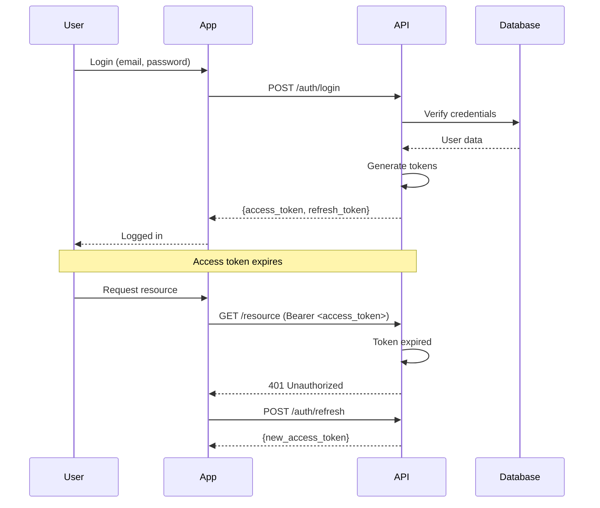
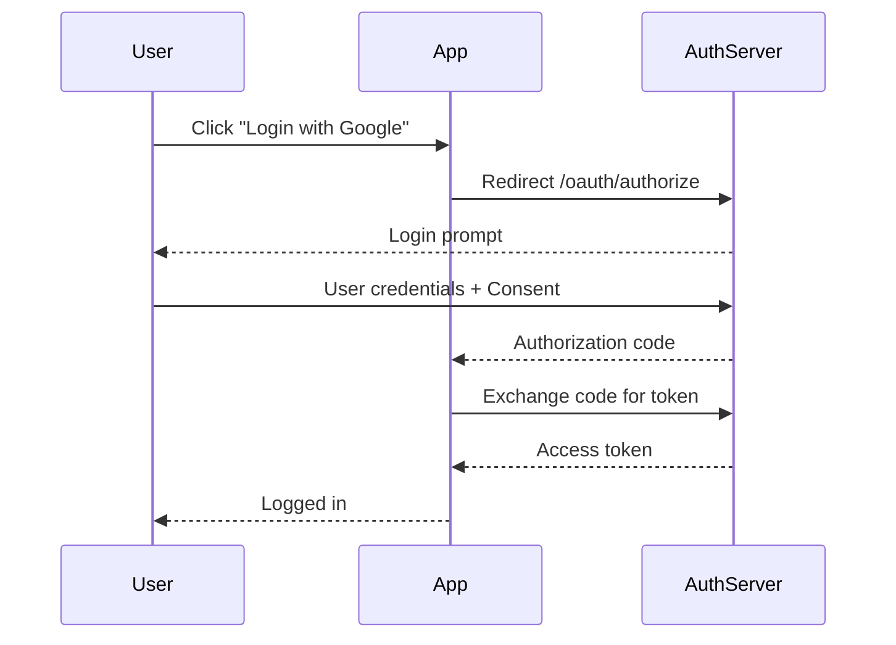
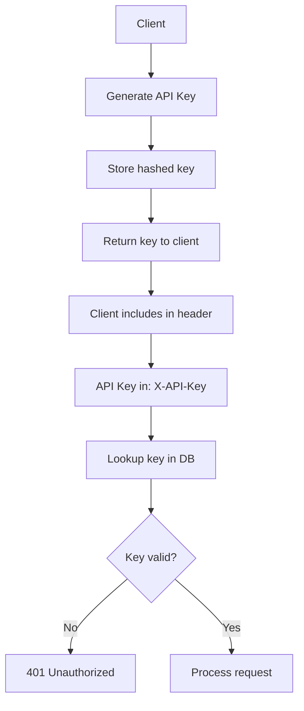

# Authentication Flows

## JWT Flow

```mermaid
sequenceDiagram
    participant User
    participant App
    participant API
    participant Database

    User->>App: Login (email, password)
    App->>API: POST /auth/login
    API->>Database: Verify credentials
    Database-->>API: User data
    API->>API: Generate tokens
    API-->>App: {access_token, refresh_token}
    App-->>User: Logged in
    
    Note over User,API: Access token expires
    
    User->>App: Request resource
    App->>API: GET /resource (Bearer <access_token>)
    API->>API: Token expired
    API-->>App: 401 Unauthorized
    App->>API: POST /auth/refresh
    API-->>App: {new_access_token}
```

## OAuth2 Authorization Code Flow

```mermaid
sequenceDiagram
    participant User
    participant App
    participant AuthServer
    
    User->>App: Click "Login with Google"
    App->>AuthServer: Redirect /oauth/authorize
    AuthServer-->>User: Login prompt
    User->>AuthServer: User credentials + Consent
    AuthServer-->>App: Authorization code
    App->>AuthServer: Exchange code for token
    AuthServer-->>App: Access token
    App-->>User: Logged in
```

## API Key Flow

```mermaid
flowchart TD
    A[Client] --> B[Generate API Key]
    B --> C[Store hashed key]
    C --> D[Return key to client]
    D --> E[Client includes in header]
    E --> F[API Key in: X-API-Key]
    F --> G[Lookup key in DB]
    G --> H{Key valid?}
    H -->|No| I[401 Unauthorized]
    H -->|Yes| J[Process request]
```