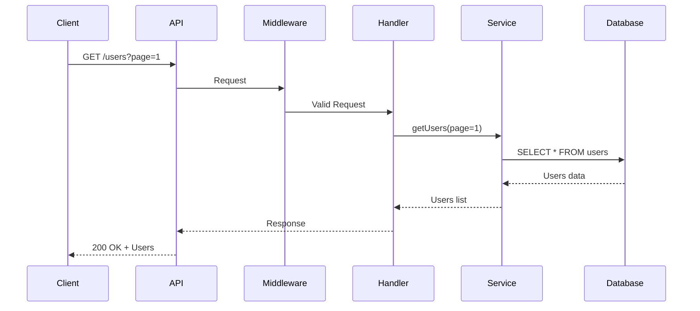
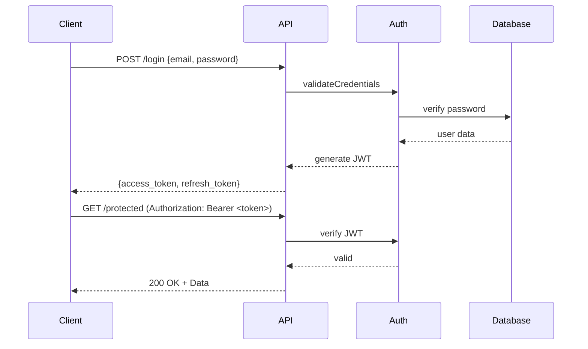
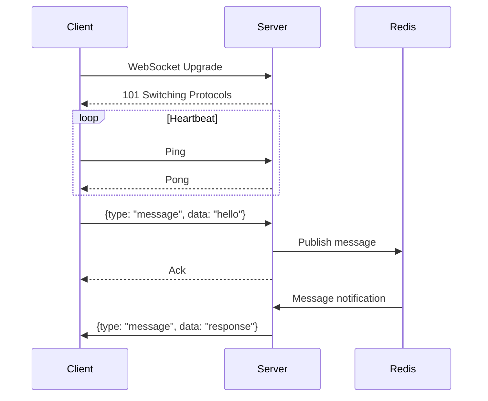
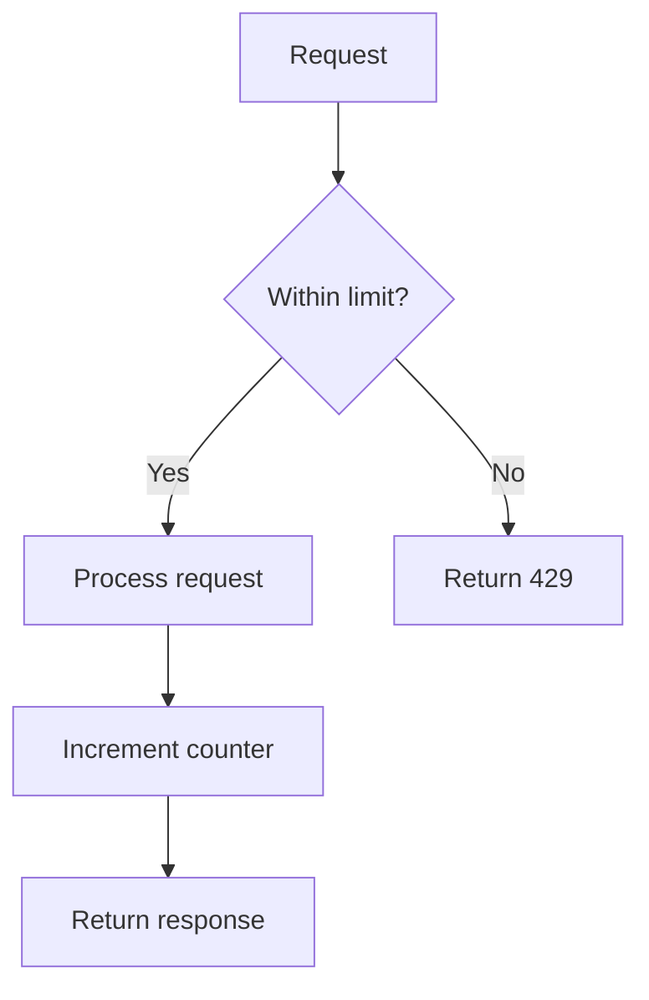

# API Request Flow

## REST Request-Response Flow

```mermaid
sequenceDiagram
    participant Client
    participant API
    participant Middleware
    participant Handler
    participant Service
    participant Database

    Client->>API: GET /users?page=1
    API->>Middleware: Request
    Middleware->>Handler: Valid Request
    Handler->>Service: getUsers(page=1)
    Service->>Database: SELECT * FROM users
    Database-->>Service: Users data
    Service-->>Handler: Users list
    Handler-->>API: Response
    API-->>Client: 200 OK + Users
```

## Authentication Flow

```mermaid
sequenceDiagram
    participant Client
    participant API
    participant Auth
    participant Database

    Client->>API: POST /login {email, password}
    API->>Auth: validateCredentials
    Auth->>Database: verify password
    Database-->>Auth: user data
    Auth-->>API: generate JWT
    API-->>Client: {access_token, refresh_token}

    Client->>API: GET /protected (Authorization: Bearer <token>)
    API->>Auth: verify JWT
    Auth-->>API: valid
    API-->>Client: 200 OK + Data
```

## WebSocket Flow

```mermaid
sequenceDiagram
    participant Client
    participant Server
    participant Redis

    Client->>Server: WebSocket Upgrade
    Server-->>Client: 101 Switching Protocols
    
    loop Heartbeat
        Client->>Server: Ping
        Server-->>Client: Pong
    end
    
    Client->>Server: {type: "message", data: "hello"}
    Server->>Redis: Publish message
    Server-->>Client: Ack
    
    Redis->>Server: Message notification
    Server->>Client: {type: "message", data: "response"}
```

## Rate Limiting Flow

```mermaid
flowchart TD
    A[Request] --> B{Within limit?}
    B -->|Yes| C[Process request]
    B -->|No| D[Return 429]
    C --> E[Increment counter]
    E --> F[Return response]
```