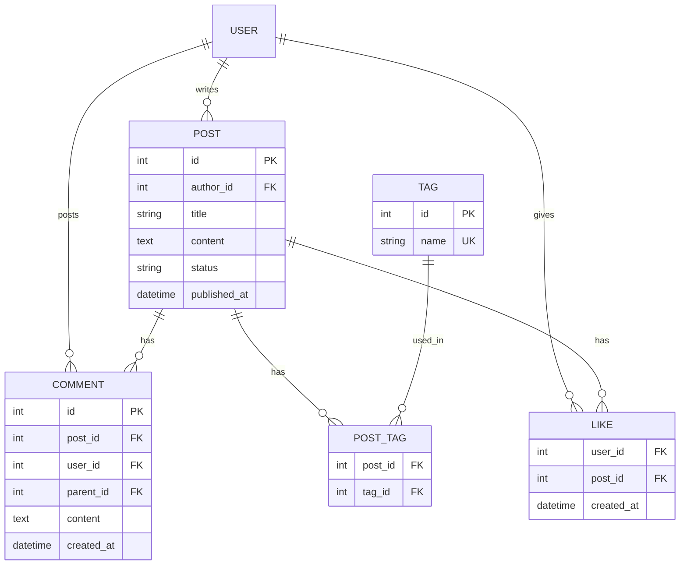
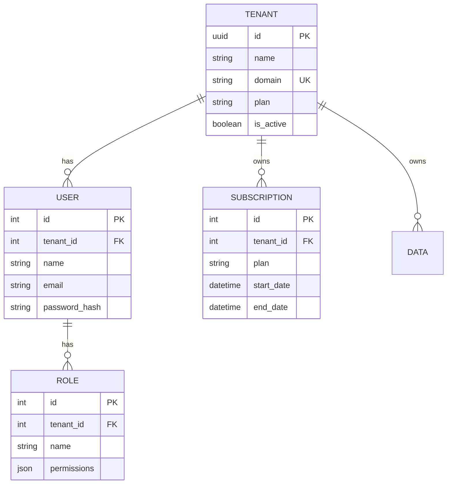
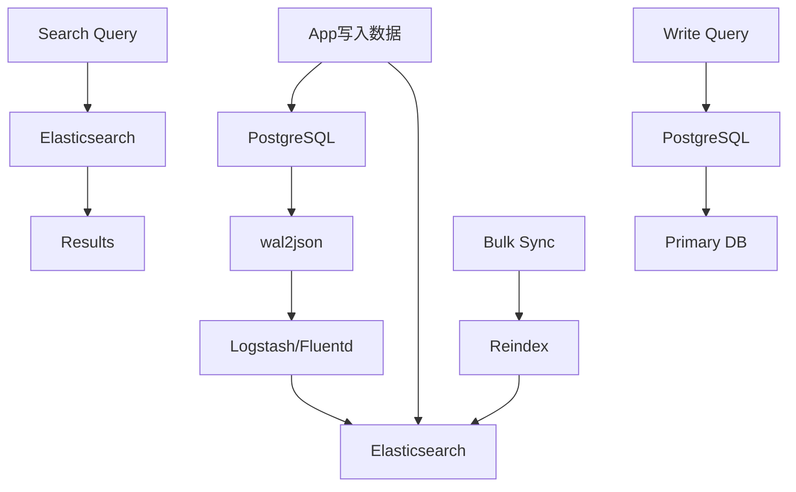
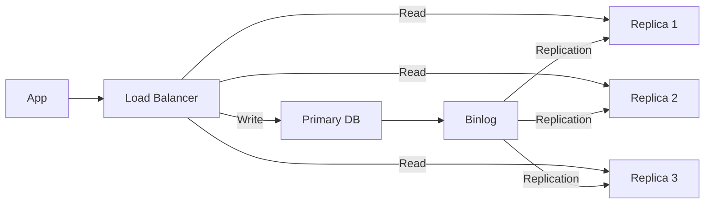

# Advanced ERD

## E-commerce Model

```mermaid
erDiagram
    USER ||--o{ ORDER : places
    USER ||--o{ ADDRESS : has
    USER ||--o{ REVIEW : writes
    ORDER ||--o{ ORDER_ITEM : contains
    ORDER ||--|| PAYMENT : has
    PRODUCT ||--o{ ORDER_ITEM : in
    PRODUCT ||--o{ REVIEW : has
    PRODUCT ||--o{ PRODUCT_CATEGORY : belongs
    CATEGORY ||--o{ PRODUCT_CATEGORY : has

    USER {
        int id PK
        string name
        string email UK
        string password_hash
        boolean is_active
        datetime created_at
    }

    ORDER {
        int id PK
        int user_id FK
        decimal total
        string status
        datetime created_at
    }

    ORDER_ITEM {
        int id PK
        int order_id FK
        int product_id FK
        int quantity
        decimal price
    }

    PRODUCT {
        int id PK
        string name
        text description
        decimal price
        int stock
        boolean is_active
    }

    PAYMENT {
        int id PK
        int order_id FK UK
        string method
        string status
        decimal amount
    }

    REVIEW {
        int id PK
        int user_id FK
        int product_id FK
        int rating
        text comment
        datetime created_at
    }

    ADDRESS {
        int id PK
        int user_id FK
        string street
        string city
        string state
        string zip_code
    }

    CATEGORY {
        int id PK
        string name
        int parent_id FK
    }

    PRODUCT_CATEGORY {
        int product_id FK
        int category_id FK
    }
```

## Blog System



## Multi-tenant System



## Full-text Search Integration



## Read/Write Separation

