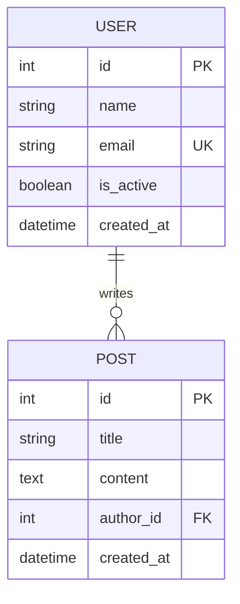

# ERD - Basic Models

## Mermaid



## ASCII

```
┌─────────────┐       ┌─────────────┐
│    USER    │       │    POST    │
├─────────────┤       ├─────────────┤
│ id (PK)     │       │ id (PK)    │
│ name        │       │ title      │
│ email (UK)  │───┐   │ content   │
│ is_active  │   │───│ author_id│
│ created_at │       │ created_at │
└─────────────┘       └─────────────┘
```

## Relationship Types

| Type | Symbol |
|------|--------|
| One to One | `||--||` |
| One to Many | `||--o{` |
| Many to Many | `o{--o{` |