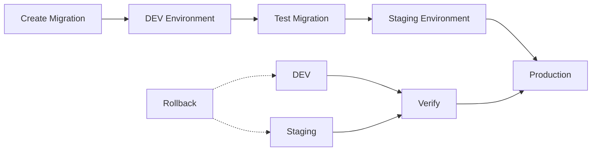
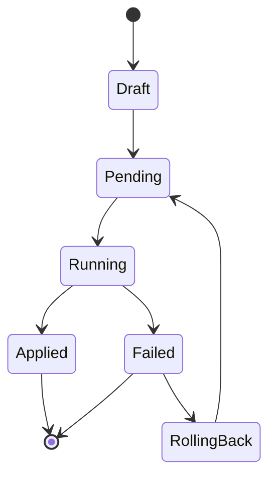

# Migration Flow

## Workflow Diagram



## Migration States



## Alembic Flow

```
┌─────────────────────────────────────────────┐
│              Development                    │
├─────────────────────────────────────────────┤
│ 1. model.create_all() / alter table        │
│ 2. alembic revision --autogenerate         │
│ 3. alembic upgrade head                  │
│ 4. Test / Verify                        │
└─────────────────────────────────────────────┘
                   │
                   ▼
┌─────────────────────────────────────────────┐
│              CI/CD Pipeline                 │
├─────────────────────────────────────────────┤
│ 1. alembic upgrade +1                     │
│ 2. Run tests                           │
│ 3. alembic downgrade +1 (rollback test) │
│ 4. Deploy                              │
└─────────────────────────────────────────────┘
```