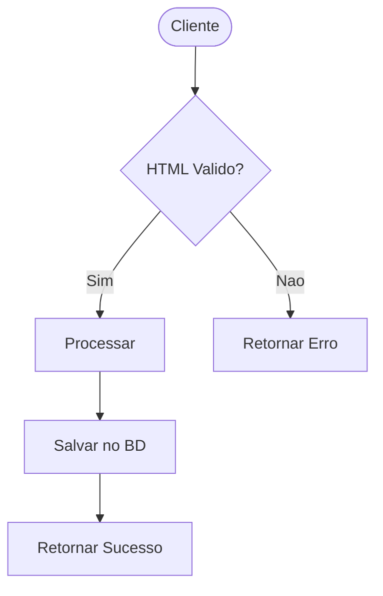
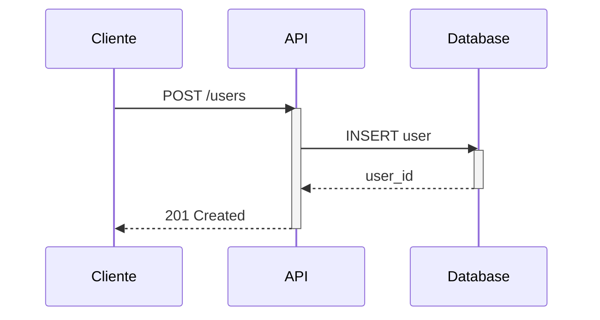
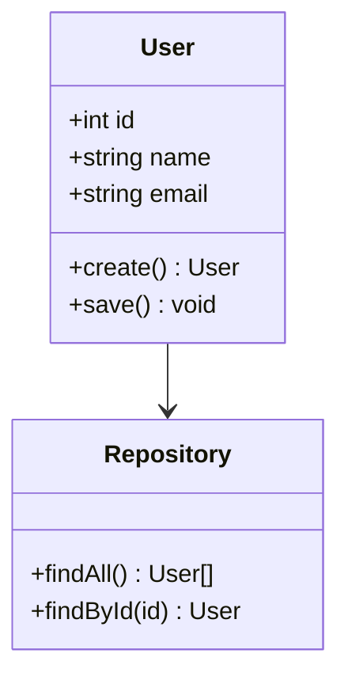
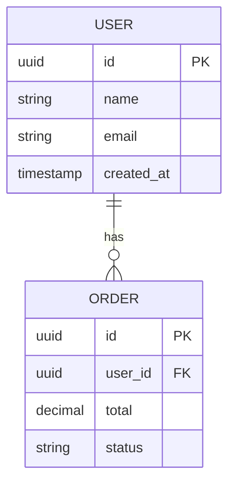

# Diagram Drawing Skill

Guia completo para criação de diagramas usando Draw.io, Mermaid.js e conversão HTML→SVG.

---

## 1. Visão Geral

| Abordagem | Ferramenta | Uso Principal |
|-----------|-----------|--------------|
| **Draw.io** | Editor visual XML | Diagramas profissionais |
| **Mermaid.js** | CLI / Live Preview | Código como texto |
| **HTML/CSS** | Puppeteer / wkhtmltopdf | Total controle |

---

## 2. Draw.io

### 2.1 Editor Online

- **app.diagrams.net** - Editor online gratuito
- **Desktop:** draw.io app para Windows/Mac/Linux
- **VS Code:** Extensão "Draw.io Integration"

### 2.2 Exportar para SVG

```bash
# Via CLI (requer draw.io desktop)
draw.io --export=svg --crop --output=output.svg input.drawio
```

```powershell
# PowerShell
& "C:\Program Files\draw.io\draw.io.exe" --export=svg --crop --output=output.svg input.drawio
```

### 2.3 Templates Disponíveis

| Template | Arquivo | Descrição |
|----------|--------|----------|
| Fluxograma | `flowchart.drawio` | Processos e decisões |
| Sequência | `sequence.drawio` | Fluxo de API |
| Arquitetura | `architecture.drawio` | Arquitetura de sistema |
| ER | `er-diagram.drawio` | Entidade-Relacionamento |
| Classes | `class-diagram.drawio` | Diagrama de classes UML |
| AWS | `aws-architecture.drawio` | Arquitetura AWS |

---

## 3. Mermaid.js

### 3.1 Instalação

```bash
# npm global
npm install -g @mermaid-js/mermaid-cli

# ou local
npm install mermaid @mermaid-js/mermaid-cli --save-dev
```

### 3.2 Comandos Básicos

```bash
# Renderizar para SVG
mmdc -i input.mmd -o output.svg

# Renderizar para PNG
mmdc -i input.mmd -o output.png

# Com tema
mmdc -i input.mmd -o output.svg -t dark

# Com background transparente
mmdc -i input.mmd -o output.svg -b transparent
```

### 3.3 Temas Disponíveis

```bash
# Temas: default, dark, forest, neutral, night, baseball
mmdc -i input.mmd -o output.svg -t dark
```

### 3.4 Templates Mermaid

| Template | Arquivo | Descrição |
|----------|--------|----------|
| Fluxograma | `flowchart.mmd` | graph TD/LR |
| Sequência | `sequence.mmd` | sequenceDiagram |
| Classes | `class.mmd` | classDiagram |
| ER | `er.mmd` | erDiagram |
| Estado | `state.mmd` | stateDiagram |
| Gantt | `gantt.mmd` | gantt |

### 3.5 Exemplos de Código

#### Fluxograma (graph TD)



#### Sequência (sequenceDiagram)



#### Classes (classDiagram)



#### ER (erDiagram)



### 3.6 Live Preview

```bash
# Iniciar servidor local
npx mermaid-filter --watch input.mmd
```

Ou usar o editor online: **mermaid.live**

---

## 4. HTML para SVG

### 4.1 Renderizador HTML

Use o arquivo `html/renderer.html` para criar diagramas via código HTML/CSS.

### 4.2 Conversão para SVG

```bash
# Puppeteer (requer Node.js)
node scripts/html_to_svg.js input.html output.svg
```

```powershell
# PowerShell
node scripts/html_to_svg.js input.html output.svg
```

### 4.3 wkhtmltopdf (alternativa)

```bash
wkhtmltopdf --enable-svg input.html output.svg
```

---

## 5. Scripts de Automação

| Script | Funcionalidade |
|--------|-------------|
| `drawio_to_svg.sh` | Draw.io → SVG |
| `mermaid_to_svg.sh` | Mermaid → SVG |
| `html_to_svg.sh` | HTML → SVG |
| `preview.sh` | Live preview |
| `all.sh` | Compilar todos |

### 5.1 Como Usar

```bash
# Renderizar template mermaid
./scripts/mermaid_to_svg.sh templates/mermaid/flowchart.mmd

# Renderizar HTML
./scripts/html_to_svg.sh html/flowchart.html

# Live preview
./scripts/preview.sh
```

### 5.2 PowerShell

```powershell
.\scripts\mermaid_to_svg.ps1 -InputFile "templates\mermaid\flowchart.mmd"
```

---

## 6. Fluxo de Trabalho

### 6.1 Criar Diagrama

1. **Escolha a ferramenta:**
   - Draw.io: Editor visual
   - Mermaid: Código como texto
   - HTML: Total controle

2. **Criar/Editar template:**
   - Use os templates fornecidos
   - Ou crie novo do zero

3. **Exportar para SVG:**
   ```bash
   ./scripts/mermaid_to_svg.sh template.mmd
   ```

### 6.2 Editar Diagrama

| Ferramenta | Como Editar |
|-----------|----------|
| Draw.io | Abra no editor draw.io |
| Mermaid | Edite o código .mmd |
| HTML | Edite o HTML/CSS |

### 6.3 Integrar no Projeto

```markdown
# Arquitetura do Sistema


```

---

## 7. Dicas e Boas Práticas

### 7.1 Fluxograma

- Use cores consistentes
-保持 shape sizes uniformes
- Adicione labels claros nas setas

### 7.2 Diagrama de Sequência

- Mantenha lifeline widths iguais
- Use cores para atores/sistemas
- Adicione notas para contexto

### 7.3 ER Diagram

- Use PK/FK notation
- Agrupe entidades por domínio
- Use cores para tabelas relacionadas

### 7.4 Arquitetura

- Use ícones padronizados
- Agrupe por camada (frontend/backend/db)
- Indique fluxo de dados com cores

---

## 8. Recursos Adicionais

### 8.1 Editores Online

| Editor | URL |
|--------|-----|
| Draw.io | app.diagrams.net |
| Mermaid | mermaid.live |
| PlantUML | www.plantuml.com/plantuml |

### 8.2 Extensões VS Code

- Draw.io Integration
- Mermaid Markdown Syntax
- PlantUML

### 8.3 Ícones

Os ícones disponíveis em `assets/icons/` podem ser usados em diagramas Draw.io.

---

## 9. Referências

- [Draw.io](https://app.diagrams.net/)
- [Mermaid.js](https://mermaid.js.org/)
- [Mermaid CLI](https://github.com/mermaid-js/mermaid-cli)
- [Mermaid Live Editor](https://mermaid.live)