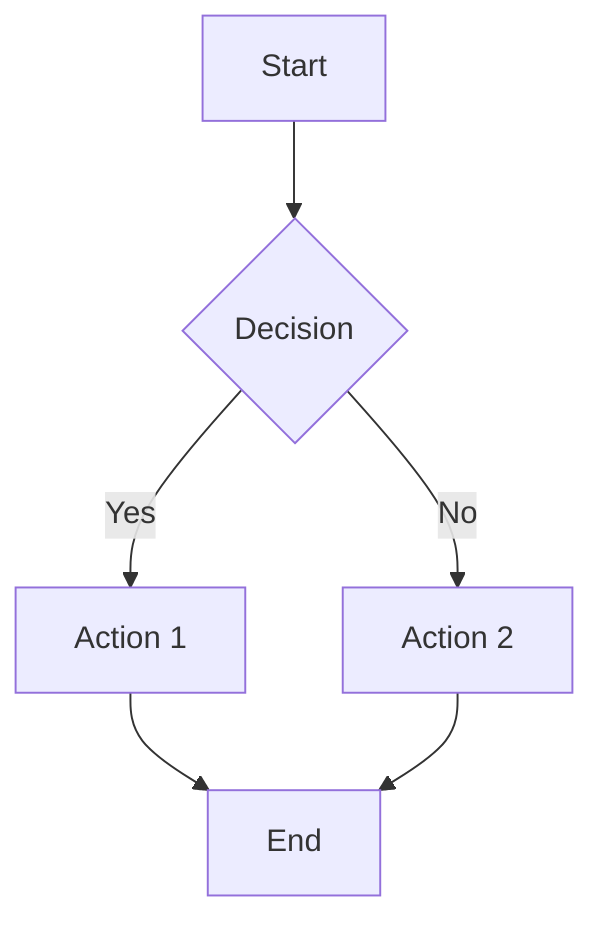
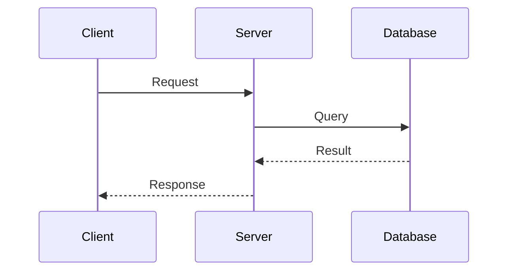
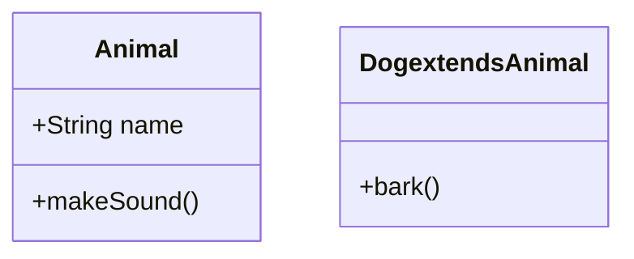
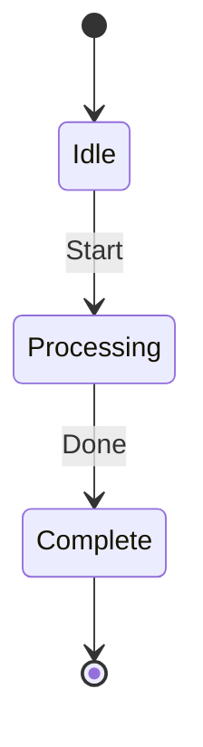

# MkDocs Extensions

Guia de extensões Markdown para MkDocs Material.

---

## 1. Admonitions

### 1.1 Tipos de Admonition

```markdown
!!! note
    This is a note.

!!! tip "Custom Title"
    This tip has a custom title.

!!! warning
    This is a warning.

!!! danger
    This is danger!
```

### 1.2 Tipos Disponíveis

| Tipo | Description | Cor |
|------|------------|-----|
| note | Informational | Blue |
| tip | Helpful tip | Green |
| info | General info | Cyan |
| warning | Warning | Yellow |
| danger | Critical | Red |

### 1.3 Collapsible

```markdown
???+ note
    This is collapsible and expanded by default.

??? note
    This is collapsible but collapsed.
```

---

## 2. Code Blocks

### 2.1 Syntax Highlighting

````markdown
```python
def hello():
    print("Hello, World!")
```
````

### 2.2 Linenums

````markdown
```python hl_lines="2 3"
def hello():
    print("Highlighted")
    return True
```
````

### 2.3 Title

````markdown
```python title="hello.py"
def hello():
    print("Hello, World!")
```
````

### 2.4 Annotations

````markdown
```python
def hello():(1)
    print("Hello")(2)
```

1. Function definition
2. Print statement
````

---

## 3. Tabs

### 3.1 Basic Tabs

```markdown
=== "Tab 1"
    Content of tab 1.

=== "Tab 2"
    Content of tab 2.
```

### 3.2 Tabs with Code

```markdown
=== "npm"
    ```bash
    npm install my-package
    ```

=== "yarn"
    ```bash
    yarn add my-package
    ```
```

### 3.3 Nested Tabs

```markdown
=== "Linux"
    === "Ubuntu"
        Content for Ubuntu
    === "Fedora"
        Content for Fedora
```

---

## 4. Mermaid Diagrams

### 4.1 Flowchart

```markdown

```

### 4.2 Sequence Diagram

```markdown

```

### 4.3 Class Diagram

```markdown

```

### 4.4 State Diagram

```markdown

```

---

## 5. Tables

### 5.1 Basic Table

```markdown
| Column 1 | Column 2 | Column 3 |
|----------|----------|----------|
| Cell 1   | Cell 2   | Cell 3   |
| Cell 4   | Cell 5   | Cell 6   |
```

### 5.2 Aligned Table

```markdown
| Left | Center | Right |
|:-----|:------:|------:|
| L    |   C    |      R |
```

---

## 6. Meta Tags

### 6.1 Frontmatter

```markdown
---
title: Page Title
description: Page description
---
```

### 6.2 Meta inline

```markdown
<!-- markdownlint-disable MD041 -->
```

---

## 7. Icons and Emojis

### 7.1 Material Icons

```markdown
:material-home: → 🏠
:material-arrow-right: → →
:material-check: → ✓
```

### 7.2 FontAwesome

```markdown
:fontawesome-brands-github: → GitHub icon
:fontawesome-solid-code: → Code icon
```

### 7.3 Emojis

```markdown
:smile: :heart: :rocket:
```

---

## 8. Mark

### 8.1 Highlight

```markdown
==highlighted text==
```

### 8.2 Underline

```markdown
~!underlined text~!
```

---

## 9. Critic

### 9.1 Addition

```markdown
Lorem ipsum dolor sit amet.
{++ additions ++}
```

### 9.2 Deletion

```markdown
{-- deletions --}
```

### 9.3 Substitution

```markdown
{substitutions}
```

---

## 10. Task Lists

### 10.1 Checkbox

```markdown
- [ ] Unchecked
- [x] Checked
```

### 10.2 Interactive

```markdown
- [ ] Step 1
- [ ] Step 2
- [x] Completed
```

---

## Cross-refs

- [configuration.md](configuration.md) - Configuração de extensões
- [theming.md](theming.md) - Customização visual