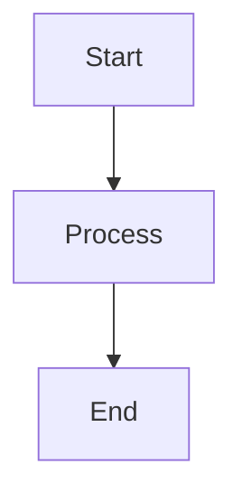

# Template: Document Page

Template para páginas de documentação em MkDocs Material.

---

## Estrutura

```markdown
---
title: Page Title
description: Brief description of the page
---

# Page Title

Brief introduction/overview of the topic.

## Overview

More detailed introduction or background information.

## Prerequisites

- Requirement 1
- Requirement 2

## Installation

### Step 1: Install Package

```bash
pip install my-package
```

### Step 2: Configure

```yaml
# config.yaml
setting: value
```

## Usage

### Basic Usage

```python
import my_package

result = my_package.doSomething()
print(result)
```

### Advanced Usage

```python
from my_package import Advanced

advanced = Advanced(option=value)
result = advanced.process()
```

## Configuration

| Option | Type | Default | Description |
|--------|------|---------|-------------|
| `option1` | string | `"default"` | Description 1 |
| `option2` | boolean | `false` | Description 2 |
| `option3` | integer | `10` | Description 3 |

## Examples

### Example 1: Basic

```markdown
# Simple example
```

### Example 2: Advanced

```markdown
# Complex example with multiple steps
```

## Troubleshooting

!!! warning "Common Issues"
    If you encounter issues, check the following:

### Issue 1: Error Message

**Solution:**

```bash
# Fix command
```

### Issue 2: Another Error

**Solution:**

```yaml
# Configuration fix
```

## Next Steps

- [Related Page 1](page1.md)
- [Related Page 2](page2.md)

## See Also

- [API Reference](api/reference.md)
- [Configuration Guide](configuration.md)
```

---

## Frontmatter

```yaml
---
title: Page Title
description: Brief description
tags: [tag1, tag2]
---
```

---

## Admonitions

```markdown
!!! note
    Informational note.

!!! tip " Helpful Tip"
    Helpful suggestion.
```

---

## Code Tabs

```markdown
=== "Python"
    ```python
    print("Hello")
    ```

=== "JavaScript"
    ```javascript
    console.log("Hello");
    ```
```

---

## Tables

### Options Table

```markdown
| Option | Type | Required | Default | Description |
|--------|------|----------|---------|-------------|
| name | string | Yes | - |
| age | number | No | 0 |
```

---

## Diagrams

```markdown

```

---

## Cross-refs

- [api-doc.md](api-doc.md) - Template para API docs
- [multi-language.md](multi-language.md) - Template para i18n