# UML Architecture Skill

Guia completo para criação de arquiteturas UML com referências cruzadas às outras skills.

---

## Referências Cruzadas

| Skill | Ver | Conteúdo |
|-------|-----|---------|
| [diagram-drawing](../diagram-drawing/SKILL.md) | Templates, conversão SVG | Mermaid, Draw.io |
| [docker-implementation](../docker-implementation/SKILL.md) | Docker deploy | Containers |
| [python-integration-testing](../python-integration-testing/SKILL.md) | Test fixtures Python | pytest |
| [jest-integration-testing](../jest-integration-testing/SKILL.md) | Test fixtures JS/TS | Jest |
| [js-airbnb-style](../js-airbnb-style/SKILL.md) | Naming conventions | JS/TS |
| [hexagonal-architecture](../hexagonal-architecture/SKILL.md) | Padrão hexagonal | Ports & Adapters |

---

## 1. Introdução UML

### 1.1 Tipos de Diagramas

| Tipo | Uso | Template |
|-------|-----|---------|
| **Class** | Modelagem de domínio | `templates/class/` |
| **Component** | Arquitetura de sistema | `templates/component/` |
| **Deployment** | Infraestrutura | `templates/deployment/` |
| **Sequence** | Fluxos de API | `templates/sequence/` |
| **Activity** | Processos de negócio | `templates/activity/` |

### 1.2 Quando Usar Cada Tipo

| Situação | Diagrama Recomendado |
|---------|---------------------|
| Modelar entidades e relacionamentos | Class Diagram |
| Definir arquitetura de camadas | Component Diagram |
| Documentar infraestrutura Docker/K8s | Deployment Diagram |
| Explicar fluxos de API | Sequence Diagram |
| Mapear processos de negócio | Activity Diagram |

---

## 2. Diagrama de Classes

### 2.1 Estrutura Base

Ver: [js-airbnb-style](../js-airbnb-style/SKILL.md) - Naming Conventions

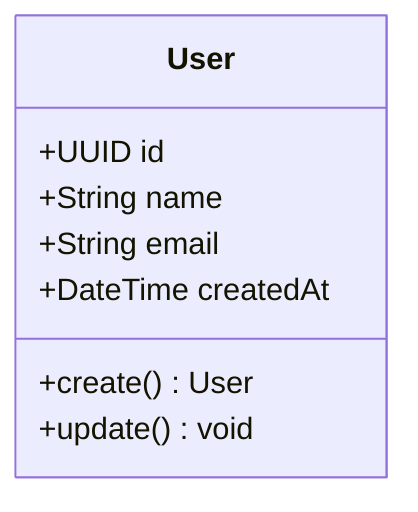

### 2.2 Padrão Repository

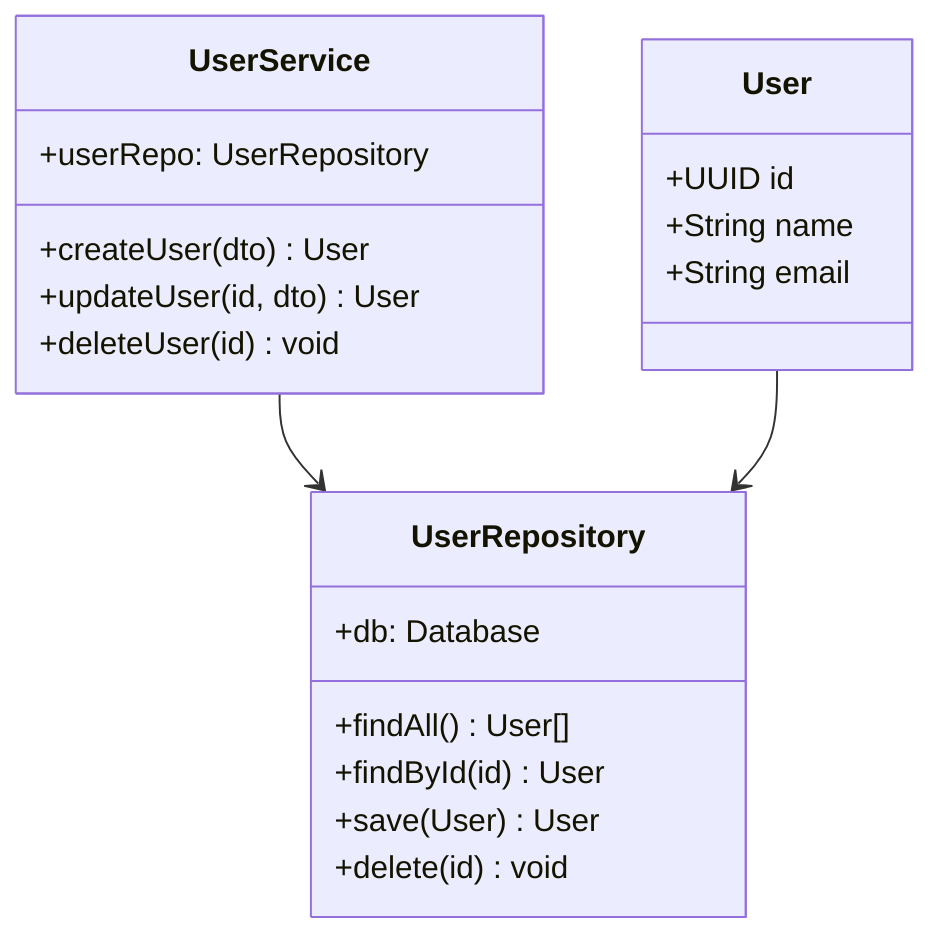

### 2.3 Templates Disponíveis

| Arquivo | Descrição |
|---------|---------|
| `class/domain-model.mmd` | Entidades User, Order, Product |
| `class/service-layer.mmd` | Services + Repositories |
| `class/cqrs.mmd` | Commands + Queries separados |

---

## 3. Diagrama de Componentes

### 3.1 Arquitetura em Camadas

Ver: [docker-implementation](../docker-implementation/SKILL.md) - Stack completa

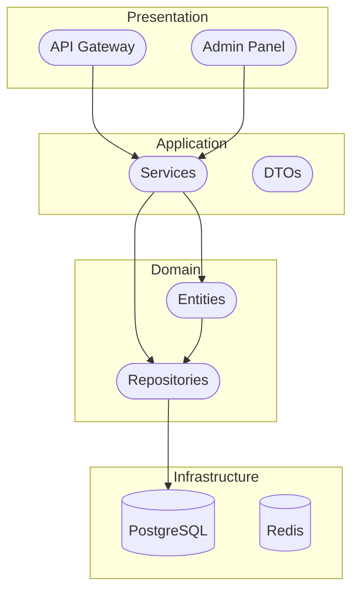

### 3.2 Arquitetura Hexagonal

Ver: [hexagonal-architecture](../hexagonal-architecture/SKILL.md)

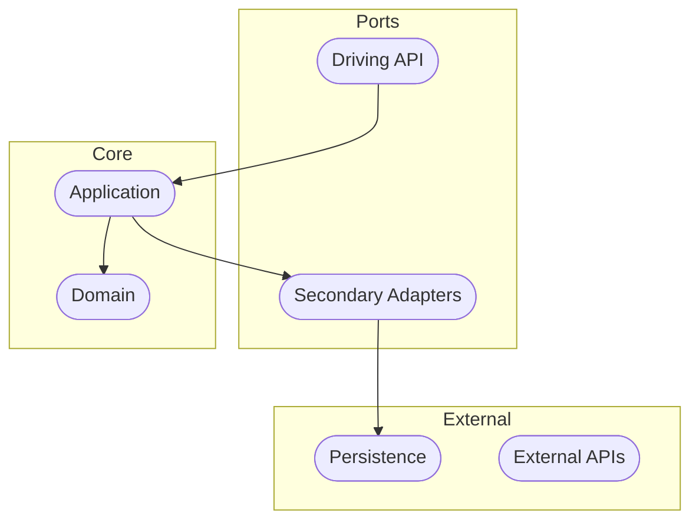

### 3.3 Microservices

Ver: [docker-implementation](../docker-implementation/SKILL.md) - Docker Compose

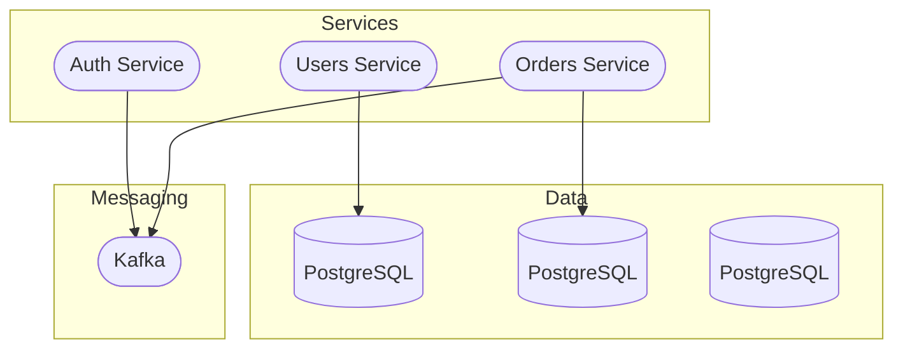

### 3.4 Templates Disponíveis

| Arquivo | Descrição |
|---------|---------|
| `component/layered.mmd` | Presentation → Application → Domain → Infrastructure |
| `component/hexagonal.mmd` | Ports & Adapters |
| `component/microservices.mmd` | Services distribuídos |
| `component/clean.mmd` | Clean Architecture |

---

## 4. Diagrama de Deploy

Ver: [docker-implementation](../docker-implementation/SKILL.md) - Dockerfiles

### 4.1 Stack Completa Docker

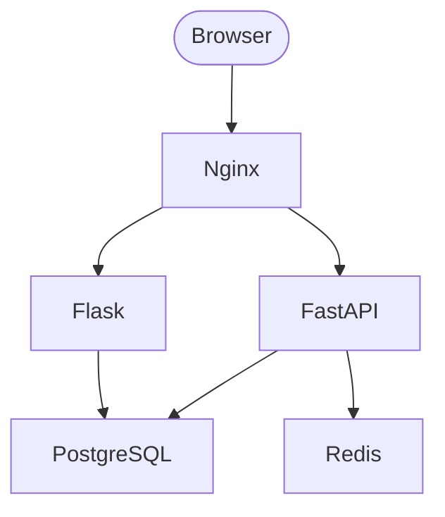

### 4.2 Kubernetes Deploy

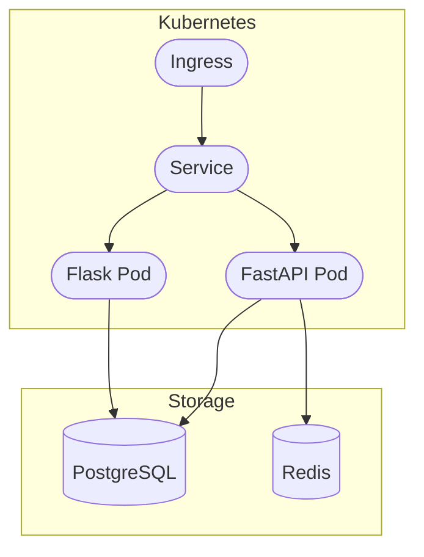

### 4.3 AWS Architecture

Ver: [docker-implementation](../docker-implementation/SKILL.md) - AWS templates

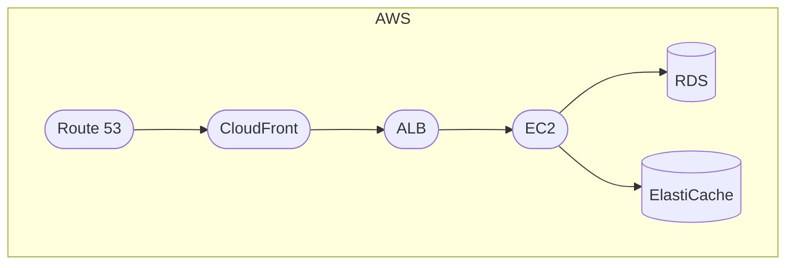

### 4.4 Templates Disponíveis

| Arquivo | Descrição |
|---------|---------|
| `deployment/docker-stack.mmd` | Flask + FastAPI + PG + Redis |
| `deployment/kubernetes.mmd` | K8s pods e services |
| `deployment/aws.mmd` | AWS architecture |

---

## 5. Diagrama de Sequência

Ver: [diagram-drawing](../diagram-drawing/SKILL.md) - Templates sequence

### 5.1 Fluxo de API

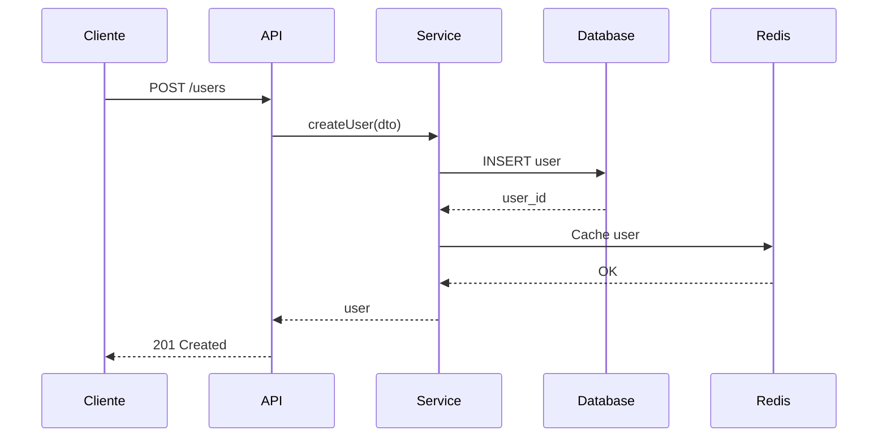

### 5.2 Fluxo de Autenticação

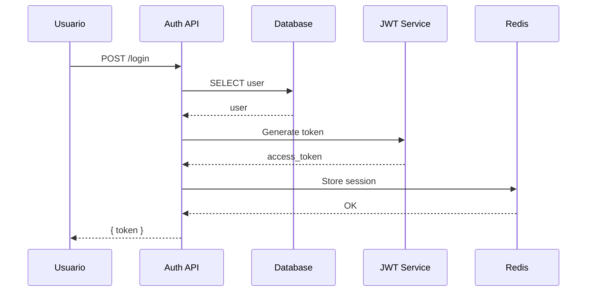

### 5.3 Templates Disponíveis

| Arquivo | Descrição |
|---------|---------|
| `sequence/api-crud.mmd` | CREATE/READ/UPDATE/DELETE |
| `sequence/auth-flow.mmd` | Fluxo de autenticação |
| `sequence/async-processing.mmd` | Processamento async |

---

## 6. Diagrama de Atividade

Ver: [diagram-drawing](../diagram-drawing/SKILL.md) - Templates flowchart

### 6.1 Fluxo de Pedido

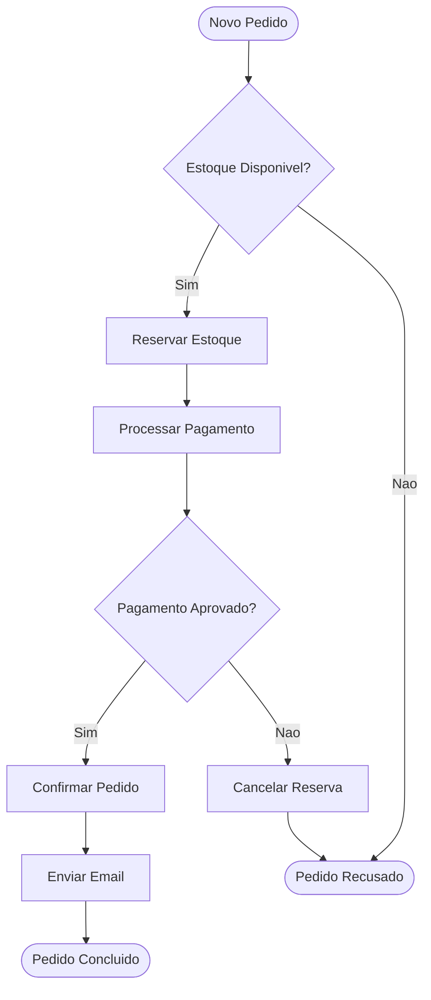

### 6.2 Fluxo de Cadastro

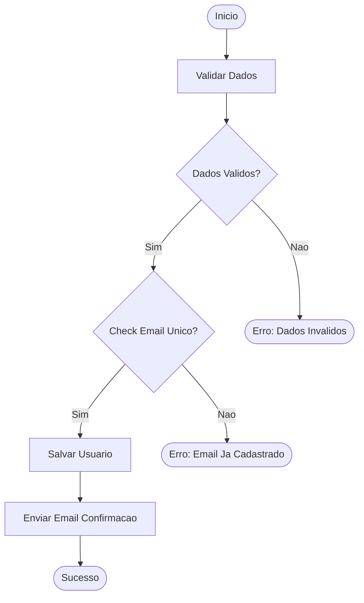

### 6.3 Templates Disponíveis

| Arquivo | Descrição |
|---------|---------|
| `activity/order-flow.mmd` | Fluxo de pedido completo |
| `activity/user-signup.mmd` | Cadastro de usuario |
| `activity/checkout.mmd` | Processo de checkout |

---

## 7. Padrões de Arquitetura

### 7.1 Layered Architecture

```
┌─────────────────────────────────────────┐
│           Presentation                  │ ← API, UI, Controllers
├─────────────────────────────────────────┤
│           Application                   │ ← Services, Use Cases
├─────────────────────────────────────────┤
│             Domain                      │ ← Entities, Value Objects
├─────────────────────────────────────────┤
│          Infrastructure               │ ← Database, External APIs
└─────────────────────────────────────────┘
```

Ver: [python-integration-testing](../python-integration-testing/SKILL.md) - Fixtures

### 7.2 Hexagonal Architecture

Ver: [hexagonal-architecture](../hexagonal-architecture/SKILL.md)

```
┌─────────────────────────────────────────┐
│            Adapters                     │ ← Primary: API, CLI
│            Adapters                     │ ← Secondary: DB, External
├─────────────────────────────────────────┤
│              Ports                      │ ← Interfaces
├─────────────────────────────────────────┤
│               Core                     │ ← Application + Domain
└─────────────────────────────────────────┘
```

### 7.3 CQRS (Command Query Responsibility Segregation)

```mermaid
graph TB
    subgraph Commands
        CMD([Commands])
        HANDLER_C([Command Handler])
    end
    subgraph Queries
        QUERY([Queries])
        HANDLER_Q([Query Handler])
    end
    HANDLER_C --> DB_W([Write DB])
    HANDLER_Q --> DB_R([Read DB])
    DB_W -.-> SYNC([Sync"]) .-> DB_R
```

### 7.4 Event-Driven Architecture

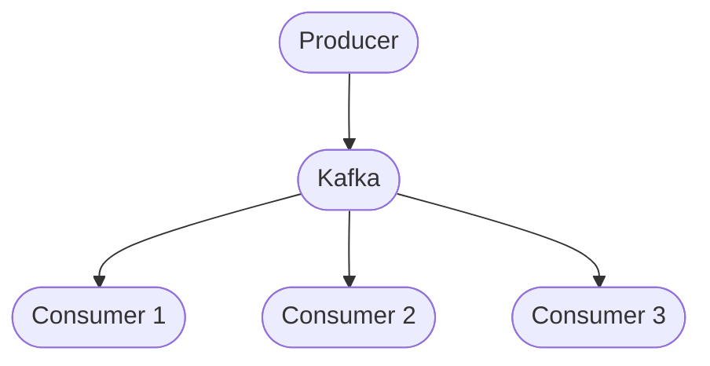

Ver: [jest-integration-testing](../jest-integration-testing/SKILL.md) - Async testing

---

## 8. Conversão para SVG

Ver: [diagram-drawing](../diagram-drawing/SKILL.md)

### 8.1 Mermaid para SVG

```bash
# Converter template Mermaid para SVG
./scripts/mermaid_to_svg.sh templates/component/layered.mmd

# Batch conversion
./scripts/all_mermaid.sh
```

### 8.2 Draw.io para SVG

1. Abra o template em [app.diagrams.net](https://app.diagrams.net)
2. File → Export → SVG
3. Salve o arquivo

### 8.3 Scripts Disponíveis

Ver: [diagram-drawing](../diagram-drawing/SKILL.md) - Scripts

| Script | Funcionalidade |
|--------|-------------|
| `mermaid_to_svg.sh` | Mermaid → SVG |
| `drawio_to_svg.sh` | Draw.io → SVG |
| `html_to_svg.sh` | HTML → SVG |
| `preview.sh` | Live preview |

---

## 9. Testes e Arquitetura

### 9.1 Python Integration Tests

Ver: [python-integration-testing](../python-integration-testing/SKILL.md)

```python
@pytest.fixture
def postgres():
    """PostgreSQL container fixture."""
    yield db_connection

@pytest.fixture
def redis_client():
    """Redis cache fixture."""
    yield redis_client
```

### 9.2 Jest Integration Tests

Ver: [jest-integration-testing](../jest-integration-testing/SKILL.md)

```typescript
beforeAll(async () => {
  postgres = await connectPostgres();
  redis = await connectRedis();
});
```

### 9.3 Docker Test Environment

Ver: [docker-implementation](../docker-implementation/SKILL.md)

```yaml
# docker-compose.test.yml
services:
  app:
    build: .
    depends_on:
      postgres:
        condition: service_healthy
      redis:
        condition: service_healthy
```

---

## 10. Boas Práticas

### 10.1 Naming Conventions

Ver: [js-airbnb-style](../js-airbnb-style/SKILL.md)

| Elemento | Convenção | Exemplo |
|---------|----------|---------|
| Classes | PascalCase | `UserService` |
| Métodos | camelCase | `createUser()` |
| Atributos | camelCase | `userId` |
| Constantes | UPPER_SNAKE_CASE | `MAX_RETRY` |

### 10.2 organização de Diagramas

| Camada | Conteúdo |
|-------|---------|
| Domain | Entities, Value Objects |
| Application | Services, Use Cases |
| Infrastructure | Repositories, External APIs |
| Presentation | Controllers, DTOs |

### 10.3 Documentação

```markdown
# Arquitetura do Sistema

## Visão Geral


## Fluxo de Dados


```

---

## Referências

| Resource | Link |
|---------|------|
| [diagram-drawing](../diagram-drawing/SKILL.md) | Templates e conversão |
| [docker-implementation](../docker-implementation/SKILL.md) | Docker setup |
| [python-integration-testing](../python-integration-testing/SKILL.md) | Test fixtures |
| [jest-integration-testing](../jest-integration-testing/SKILL.md) | Test fixtures JS |
| [js-airbnb-style](../js-airbnb-style/SKILL.md) | Naming conventions |
| [hexagonal-architecture](../hexagonal-architecture/SKILL.md) | Padrão hexagonal |